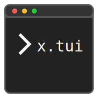

<h1 align="center"><code>x</code>.<code>tui</code> launcher</h1>

<div align="center">
<p align="center"></p>

<p>A terminal-based Android launcher that replaces your home screen with a fully functional command-line interface. Type commands, launch apps, manage files, and control your device -- all from a console prompt.</p>


<p>    </p>
</div>

<!--Menu-->
<div align="left">
  <h2>Contents</h2>
  <ul>
    <li><a href="#about">About</a></li>
    <li><a href="#features">Features</a></li>
    <li><a href="#new-commands">New Commands</a></li>
    <li><a href="#busybox">BusyBox Integration</a></li>
    <li><a href="#build-system">Build System</a></li>
    <li><a href="#security">Security Hardening</a></li>
    <li><a href="#building">Building from Source</a></li>
    <li><a href="#libraries">Open Source Libraries</a></li>
    <li><a href="#related-documents">Related Documents</a></li>
    <li><a href="#credits">Credits and Attribution</a></li>
    <li><a href="#community">Community</a></li>
    <li><a href="#license">License</a></li>
  </ul>
</div>


<h2 id="about" align="center">About</h2>

x.tui launcher is a fork of the T-UI Console Launcher, originally created by <a href="https://github.com/fAndreuzzi">Francesco Andreuzzi (fAndreuzzi)</a>, with additional contributions from the <a href="https://github.com/v1nc/TUI-Expert">T-UI Expert</a> fork maintained by <a href="https://github.com/v1nc">v1nc</a>.

This fork has been modernized and hardened for current Android versions, with new commands, a built-in BusyBox manager, theme presets, and security improvements following the OWASP MASVS standard.

<blockquote>
On the very first install, if background transparency does not take effect immediately, type <code>restart</code> in the terminal and press enter.
</blockquote>


<h2 id="features" align="center">Features</h2>

- **Full terminal home screen** -- replaces the default Android launcher with a CLI
- **App launching** -- type app names to open them instantly
- **Built-in file manager** -- navigate your filesystem with standard commands
- **Theme presets** -- switch between curated color schemes in one command
- **BusyBox integration** -- 300+ Linux utilities available via the built-in installer
- **Notification reader** -- view Android notifications directly in the console
- **Notes system** -- store and retrieve quick notes from the terminal
- **Weather display** -- real-time weather information in the status area
- **Custom header** -- display contents of a custom text file at the top of the screen
- **Configurable status lines** -- time, battery, RAM, storage, network, and more
- **Shortcut suggestions** -- interactive buttons for quick command access


<h2 id="new-commands" align="center">New Commands</h2>

<h3>username</h3>

```
username [user] [device]
```

Instantly customize your terminal prompt. Changes both the username and device name displayed in the console and reloads the UI to apply.

<h3>theme -preset</h3>

```
theme -preset [name]
```

Rapidly switch between pre-configured themes. Available presets: `blue`, `red`, `green`, `pink`, `bw`, `cyberpunk`. Applying a preset automatically colors the suggestion bar and shortcut buttons to match.

<h3>bbman</h3>

```
bbman -install
bbman -remove
```

The BusyBox manager for installing, verifying, and removing Linux binaries. See the <a href="#busybox">BusyBox Integration</a> section for details.


<h2 id="busybox" align="center">BusyBox Integration</h2>

The launcher includes a built-in BusyBox manager to enable standard Linux commands directly in the terminal.

<h3>Installation</h3>

1. Type `bbman -install` in the terminal.
2. The launcher detects your CPU architecture, downloads the verified binary, and checks its SHA-256 hash.
3. Once finished, run any Linux command directly: `ls`, `grep`, `awk`, `vi`, `ping`, `top`, and more.

<h3>Removal</h3>

```
bbman -remove
```

<h3>Security</h3>

Binaries are sourced from the trusted EXALAB repository and verified against hardcoded SHA-256 hashes before installation. All downloads are performed over HTTPS.


<h2 id="build-system" align="center">Build System</h2>

<table>
  <tr>
    <td><strong>Target SDK</strong></td>
    <td>API 35 (Android 15)</td>
  </tr>
  <tr>
    <td><strong>Min SDK</strong></td>
    <td>API 21 (Android 5.0)</td>
  </tr>
  <tr>
    <td><strong>Compile SDK</strong></td>
    <td>35</td>
  </tr>
  <tr>
    <td><strong>AGP</strong></td>
    <td>9.1.1</td>
  </tr>
  <tr>
    <td><strong>Gradle</strong></td>
    <td>9.3.1</td>
  </tr>
  <tr>
    <td><strong>Java</strong></td>
    <td>17</td>
  </tr>
  <tr>
    <td><strong>AndroidX</strong></td>
    <td>Fully migrated</td>
  </tr>
  <tr>
    <td><strong>Package</strong></td>
    <td><code>x.tui.launcher</code></td>
  </tr>
</table>


<h2 id="security" align="center">Security Hardening</h2>

This project follows the <strong>OWASP Mobile Application Security Verification Standard (MASVS)</strong>.

<h3>Data Storage and Privacy (MASVS-STORAGE)</h3>

- Application data uses secure, app-private Scoped Storage
- `android:allowBackup` is disabled to prevent data extraction via ADB backups
- File sharing uses `FileProvider` for secure, permission-based access

<h3>Network Communication (MASVS-NETWORK)</h3>

- `android:usesCleartextTraffic` is disabled globally
- All network communications are forced over HTTPS (TLS 1.2+)
- Internal service endpoints have been upgraded to secure HTTPS endpoints

<h3>Platform Interaction (MASVS-PLATFORM)</h3>

- Custom permission `x.tui.launcher.permission.RECEIVE_CMD` with `protectionLevel="signature"` ensures only same-key-signed apps can send commands
- All `PendingIntents` use `FLAG_IMMUTABLE` to prevent intent redirection attacks
- All Broadcast Receivers are registered with appropriate export flags

<h3>Code Quality (MASVS-CODE)</h3>

- Release builds have R8/ProGuard enabled for minification and obfuscation
- Foreground services comply with Android 14 strict service type requirements


<h2 id="building" align="center">Building from Source</h2>

<h3>Prerequisites</h3>

- JDK 21 (Eclipse Adoptium or equivalent)
- Android SDK with build-tools for API 35

<h3>Debug Build</h3>

```bash
chmod +x gradlew
./gradlew assembleFdroidDebug
```

Output: `app/build/outputs/apk/fdroid/debug/app-fdroid-debug.apk`

<h3>Installing via ADB</h3>

```bash
adb install -r app/build/outputs/apk/fdroid/debug/app-fdroid-debug.apk
```

For more detailed build and deployment instructions, see <a href="./docs/BUILDING.md">docs/BUILDING.md</a>.


<h2 id="libraries" align="center">Open Source Libraries</h2>

<table>
  <tr>
    <th>Library</th>
    <th>Purpose</th>
  </tr>
  <tr>
    <td><a href="https://github.com/fAndreuzzi/CompareString2">CompareString2</a></td>
    <td>Fuzzy string matching for app and command suggestions</td>
  </tr>
  <tr>
    <td><a href="https://github.com/square/okhttp">OkHttp</a></td>
    <td>HTTP client for network requests</td>
  </tr>
  <tr>
    <td><a href="http://htmlcleaner.sourceforge.net/">HTML Cleaner</a></td>
    <td>HTML parsing and sanitization</td>
  </tr>
  <tr>
    <td><a href="https://github.com/json-path/JsonPath">JsonPath</a></td>
    <td>JSON data extraction</td>
  </tr>
  <tr>
    <td><a href="https://github.com/jhy/jsoup/">jsoup</a></td>
    <td>HTML document processing</td>
  </tr>
</table>


<h2 id="related-documents" align="center">Related Documents</h2>

<div align="left">
  <ul>
    <li><a href="./docs/BUILDING.md">Building and Deployment</a></li>
    <li><a href="./docs/COMMANDS.md">Commands Reference</a></li>
    <li><a href="./docs/SECURITY.md">Security Details</a></li>
    <li><a href="./docs/CHANGELOG.md">Changelog</a></li>
    <li><a href="./LICENSE">License</a></li>
  </ul>
</div>


<h2 id="credits" align="center">Credits and Attribution</h2>

<table>
  <tr>
    <th>Contributor</th>
    <th>Role</th>
    <th>Link</th>
  </tr>
  <tr>
    <td><strong>Francesco Andreuzzi (fAndreuzzi)</strong></td>
    <td>Original author of T-UI Console Launcher</td>
    <td><a href="https://github.com/fAndreuzzi">github.com/fAndreuzzi</a></td>
  </tr>
  <tr>
    <td><strong>v1nc</strong></td>
    <td>Author of T-UI Expert fork with extended features</td>
    <td><a href="https://github.com/v1nc">github.com/v1nc</a></td>
  </tr>
  <tr>
    <td><strong>X</strong></td>
    <td>Current maintainer -- modernization, security hardening, new commands</td>
    <td><a href="https://github.com/xscriptor">github.com/xscriptor</a></td>
  </tr>
</table>

<p>This project would not exist without the original work of <strong>fAndreuzzi</strong>, who designed the core architecture and concept of a fully terminal-based Android launcher. The <strong>v1nc</strong> fork introduced additional features and integrations that inspired several enhancements in this version.</p>


<h2 id="community" align="center">Community</h2>

<div align="left">
  <ul>
    <li><a href="https://www.reddit.com/r/tui_launcher/">Reddit - r/tui_launcher</a></li>
    <li><a href="https://t.me/tuilauncher">Telegram Group</a></li>
  </ul>
</div>


<h2 id="license" align="center">License</h2>

This project is licensed under the <a href="./LICENSE">MIT License</a>.

<div id="about-the-developer" align="center">
<h2>X</h2>

<a href="https://dev.xscriptor.com">
  
</a>
 & 
<a href="https://github.com/xscriptor">
  
</a>
 & 
<a href="https://www.xscriptor.com">
  
</a>

</div>
